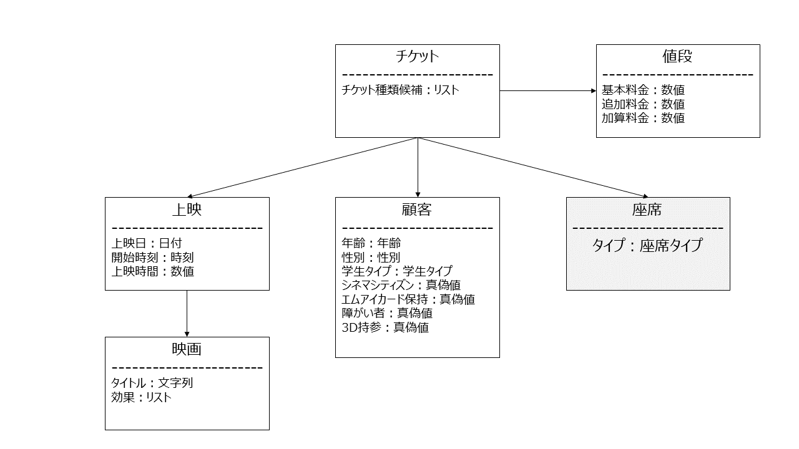
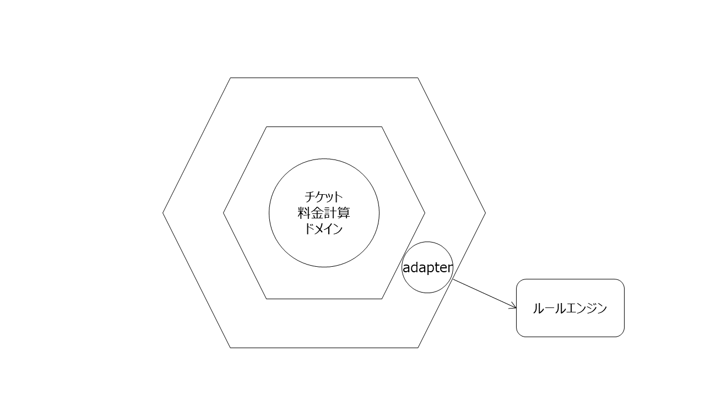

# ticket-price-modeling

## お題
https://cinemacity.co.jp/ticket/

[#チケット料金モデリング のタイムライン](https://twitter.com/search?q=%23%E3%83%81%E3%82%B1%E3%83%83%E3%83%88%E6%96%99%E9%87%91%E3%83%A2%E3%83%87%E3%83%AA%E3%83%B3%E3%82%B0&src=typed_query&f=live)

## コンセプト
エリック・エヴァンスが著書で記載しているような、ルールパラダイムとドメイン駆動設計をどう混在させるか試してみる。
```
ルールエンジンは、オブジェクト指向のアプリケーション開発プロジェクトに加えられる可能性のある技術の一例になる。
引用：エリック・エヴァンスのドメイン駆動設計
```

## ドメインモデル


## アーキテクチャ
ドメインサービスのアダプターとして、JavaのルールエンジンであるDroolsで実装している。


## ルールサンプル


## テスト
```java
    @Unroll
    def "通常の料金バリエーション_#titleで#resultが返る()"() {
        setup:
        def cinema = new Cinema("天気の子")
        def screen = new Screen(cinema, toDate(screenDate), toDateTime(startTime), 90)
        def sheet = new Sheet(sheetType)
        def customer = new Customer(new Age(toDate(birthDay), toDate(screenDate)), sex, studentType, cinemaCitizen, miCard, disability, false)
        def ticket = new Ticket(screen, sheet, customer)

        expect:
        DroolsPriceCalculator calculator = new DroolsPriceCalculator()

        ticket.calcurate(calculator)
        ticket.getPrice().totalPrice == result

        where:
        title                                      | screenDate    | startTime | birthDay     | sex      | studentType                           | sheetType        | cinemaCitizen | miCard | disability || result
        "シネマシティズン、平日、レイト無、映画の日無"   | "2019-07-08"  | "15:00"   | "1990-11-11" | Sex.Male | StudentType.Non                       | SheetType.Normal | true          | false  | false      || 1000
        "シネマシティズン、平日、レイト有、映画の日無"   | "2019-07-08"  | "20:00"   | "1990-11-11" | Sex.Male | StudentType.Non                       | SheetType.Normal | true          | false  | false      || 1000
        "シネマシティズン、休日、レイト無、映画の日無"   | "2019-07-07"  | "15:00"   | "1990-11-11" | Sex.Male | StudentType.Non                       | SheetType.Normal | true          | false  | false      || 1300
        "シネマシティズン、休日、レイト有、映画の日無"   | "2019-07-07"  | "20:00"   | "1990-11-11" | Sex.Male | StudentType.Non                       | SheetType.Normal | true          | false  | false      || 1000
        "シネマシティズン、映画の日有、平日"            | "2019-07-01"  | "14:00"   | "1990-11-11" | Sex.Male | StudentType.Non                       | SheetType.Normal | true          | false  | false      || 1000
        "シネマシティズン、映画の日有、休日"            | "2019-06-01"  | "14:00"   | "1990-11-11" | Sex.Male | StudentType.Non                       | SheetType.Normal | false         | false  | false      || 1100
        "シネマシティズン、シニア"                     | "2019-06-01"  | "14:00"   | "1940-11-11" | Sex.Male | StudentType.Non                       | SheetType.Normal | false         | false  | false      || 1100
        "一般、平日、レイト無、映画の日無"              | "2019-07-08"  | "15:00"   | "1990-11-11" | Sex.Male | StudentType.Non                       | SheetType.Normal | false         | false  | false      || 1800
        "一般、平日、レイト有、映画の日無"              | "2019-07-08"  | "20:00"   | "1990-11-11" | Sex.Male | StudentType.Non                       | SheetType.Normal | false         | false  | false      || 1300
        "一般、休日、レイト無、映画の日無"              | "2019-07-07"  | "15:00"   | "1990-11-11" | Sex.Male | StudentType.Non                       | SheetType.Normal | false         | false  | false      || 1800
        "一般、休日、レイト有、映画の日無"              | "2019-07-07"  | "20:00"   | "1990-11-11" | Sex.Male | StudentType.Non                       | SheetType.Normal | false         | false  | false      || 1300
        "一般、映画の日有"                            | "2019-07-01"  | "20:00"   | "1990-11-11" | Sex.Male | StudentType.Non                       | SheetType.Normal | false         | false  | false      || 1100
        "シニア、平日、レイト無、映画の日無"             | "2019-07-08"  | "15:00"   | "1930-11-11" | Sex.Male | StudentType.Non                       | SheetType.Normal | false         | false  | false      || 1100
        "シニア、平日、レイト有、映画の日無"             | "2019-07-08"  | "20:00"   | "1930-11-11" | Sex.Male | StudentType.Non                       | SheetType.Normal | false         | false  | false      || 1100
        "シニア、休日、レイト無、映画の日無"             | "2019-07-07"  | "15:00"   | "1930-11-11" | Sex.Male | StudentType.Non                       | SheetType.Normal | false         | false  | false      || 1100
        "シニア、休日、レイト有、映画の日無"             | "2019-07-07"  | "20:00"   | "1930-11-11" | Sex.Male | StudentType.Non                       | SheetType.Normal | false         | false  | false      || 1100
        "シニア、映画の日有"                           | "2019-07-01"  | "20:00"   | "1930-11-11" | Sex.Male | StudentType.Non                       | SheetType.Normal | false         | false  | false      || 1100
        "学生（大・専）、平日、レイト無、映画の日無"      | "2019-07-08"  | "15:00"   | "1990-11-11" | Sex.Male | StudentType.CollageStudent            | SheetType.Normal | false         | false  | false      || 1500
        "学生（大・専）、平日、レイト有、映画の日無"      | "2019-07-08"  | "20:00"   | "1990-11-11" | Sex.Male | StudentType.CollageStudent            | SheetType.Normal | false         | false  | false      || 1300
        "学生（大・専）、休日、レイト無、映画の日無"      | "2019-07-07"  | "15:00"   | "1990-11-11" | Sex.Male | StudentType.CollageStudent            | SheetType.Normal | false         | false  | false      || 1500
        "学生（大・専）、休日、レイト有、映画の日無"      | "2019-07-07"  | "20:00"   | "1990-11-11" | Sex.Male | StudentType.CollageStudent            | SheetType.Normal | false         | false  | false      || 1300
        "学生（大・専）、映画の日有"                    | "2019-07-01"  | "20:00"   | "1990-11-11" | Sex.Male | StudentType.CollageStudent            | SheetType.Normal | false         | false  | false      || 1100
        "中・高校生、平日、レイト無、映画の日無"         | "2019-07-08"  | "15:00"   | "1990-11-11" | Sex.Male | StudentType.HighSchoolStudent          | SheetType.Normal | false         | false  | false      || 1000
        "中・高校生、平日、レイト有、映画の日無"         | "2019-07-08"  | "20:00"   | "1990-11-11" | Sex.Male | StudentType.HighSchoolStudent          | SheetType.Normal | false         | false  | false      || 1000
        "中・高校生、休日、レイト無、映画の日無"         | "2019-07-07"  | "15:00"   | "1990-11-11" | Sex.Male | StudentType.HighSchoolStudent          | SheetType.Normal | false         | false  | false      || 1000
        "中・高校生、休日、レイト有、映画の日無"         | "2019-07-07"  | "20:00"   | "1990-11-11" | Sex.Male | StudentType.HighSchoolStudent          | SheetType.Normal | false         | false  | false      || 1000
        "中・高校生、映画の日有"                       | "2019-07-01"  | "20:00"   | "1990-11-11" | Sex.Male | StudentType.HighSchoolStudent          | SheetType.Normal | false         | false  | false      || 1000
        "幼児（3才以上）・小学生、平日、レイト無、映画の日無" | "2019-07-08"  | "15:00"   | "1990-11-11" | Sex.Male | StudentType.JuniorHighSchoolStudent | SheetType.Normal | false         | false  | false      || 1000
        "幼児（3才以上）・小学生、平日、レイト有、映画の日無" | "2019-07-08"  | "20:00"   | "1990-11-11" | Sex.Male | StudentType.JuniorHighSchoolStudent | SheetType.Normal | false         | false  | false      || 1000
        "幼児（3才以上）・小学生、休日、レイト無、映画の日無" | "2019-07-07"  | "15:00"   | "1990-11-11" | Sex.Male | StudentType.JuniorHighSchoolStudent | SheetType.Normal | false         | false  | false      || 1000
        "幼児（3才以上）・小学生、休日、レイト有、映画の日無" | "2019-07-07"  | "20:00"   | "1990-11-11" | Sex.Male | StudentType.JuniorHighSchoolStudent | SheetType.Normal | false         | false  | false      || 1000
        "幼児（3才以上）・小学生、映画の日有"               | "2019-07-01"  | "20:00"   | "1990-11-11" | Sex.Male | StudentType.JuniorHighSchoolStudent | SheetType.Normal | false         | false  | false      || 1000
        "幼児（3才以上）・小学生、平日、レイト無、映画の日無" | "2019-07-08"  | "15:00"   | "2014-11-11" | Sex.Male | StudentType.Non                     | SheetType.Normal | false         | false  | false      || 1000
        "幼児（3才以上）・小学生、平日、レイト有、映画の日無" | "2019-07-08"  | "20:00"   | "2014-11-11" | Sex.Male | StudentType.Non                     | SheetType.Normal | false         | false  | false      || 1000
        "幼児（3才以上）・小学生、休日、レイト無、映画の日無" | "2019-07-07"  | "15:00"   | "2014-11-11" | Sex.Male | StudentType.Non                     | SheetType.Normal | false         | false  | false      || 1000
        "幼児（3才以上）・小学生、休日、レイト有、映画の日無" | "2019-07-07"  | "20:00"   | "2014-11-11" | Sex.Male | StudentType.Non                     | SheetType.Normal | false         | false  | false      || 1000
        "幼児（3才以上）・小学生、映画の日有"               | "2019-07-01"  | "20:00"   | "2014-11-11" | Sex.Male | StudentType.Non                     | SheetType.Normal | false         | false  | false      || 1000
        "障がい者（学生以上）、平日、レイト無、映画の日無"    | "2019-07-08"  | "15:00"   | "1990-11-11" | Sex.Male | StudentType.Non                     | SheetType.Normal | false         | false  | true       || 1000
        "障がい者（学生以上）、平日、レイト有、映画の日無"    | "2019-07-08"  | "20:00"   | "1990-11-11" | Sex.Male | StudentType.Non                     | SheetType.Normal | false         | false  | true       || 1000
        "障がい者（学生以上）、休日、レイト無、映画の日無"    | "2019-07-07"  | "15:00"   | "1990-11-11" | Sex.Male | StudentType.Non                     | SheetType.Normal | false         | false  | true       || 1000
        "障がい者（学生以上）、休日、レイト有、映画の日無"    | "2019-07-07"  | "20:00"   | "1990-11-11" | Sex.Male | StudentType.Non                     | SheetType.Normal | false         | false  | true       || 1000
        "障がい者（学生以上）、映画の日有"                  | "2019-07-01"  | "20:00"   | "1990-11-11" | Sex.Male | StudentType.Non                     | SheetType.Normal | false         | false  | true       || 1000
        "障がい者（高校以下）、平日、レイト無、映画の日無"    | "2019-07-08"  | "15:00"   | "2005-11-11" | Sex.Male | StudentType.Non                     | SheetType.Normal | false         | false  | true       || 900
        "障がい者（高校以下）、平日、レイト有、映画の日無"    | "2019-07-08"  | "20:00"   | "2005-11-11" | Sex.Male | StudentType.Non                     | SheetType.Normal | false         | false  | true       || 900
        "障がい者（高校以下）、休日、レイト無、映画の日無"    | "2019-07-07"  | "15:00"   | "2005-11-11" | Sex.Male | StudentType.Non                     | SheetType.Normal | false         | false  | true       || 900
        "障がい者（高校以下）、休日、レイト有、映画の日無"    | "2019-07-07"  | "20:00"   | "2005-11-11" | Sex.Male | StudentType.Non                     | SheetType.Normal | false         | false  | true       || 900
        "障がい者（高校以下）、映画の日有"                  | "2019-07-01"  | "20:00"   | "2005-11-11" | Sex.Male | StudentType.Non                     | SheetType.Normal | false         | false  | true       || 900
        "エムアイカード、平日、レイト無、映画の日無"         | "2019-07-08"  | "15:00"   | "1990-11-11" | Sex.Male | StudentType.Non                     | SheetType.Normal | false         | true   | false      || 1600
        "エムアイカード、平日、レイト有、映画の日無"         | "2019-07-08"  | "20:00"   | "1990-11-11" | Sex.Male | StudentType.Non                     | SheetType.Normal | false         | true   | false      || 1300
        "エムアイカード、休日、レイト無、映画の日無"         | "2019-07-07"  | "15:00"   | "1990-11-11" | Sex.Male | StudentType.Non                     | SheetType.Normal | false         | true   | false      || 1600
        "エムアイカード、休日、レイト有、映画の日無"         | "2019-07-07"  | "20:00"   | "1990-11-11" | Sex.Male | StudentType.Non                     | SheetType.Normal | false         | true   | false      || 1300
    }
```